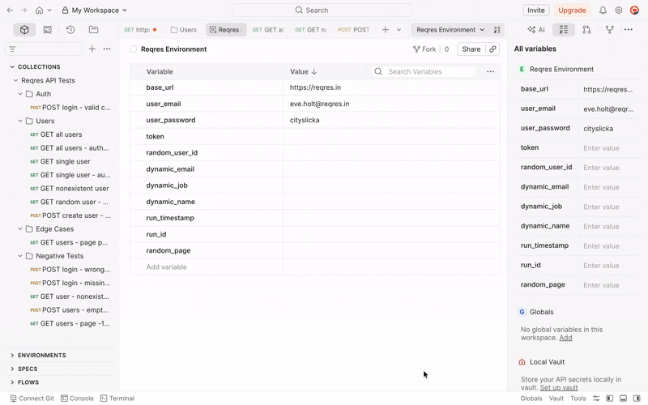
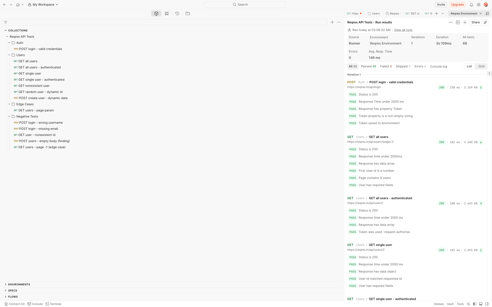
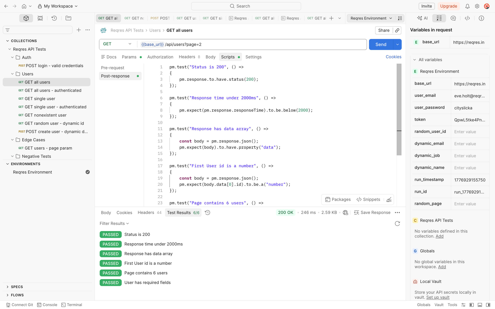
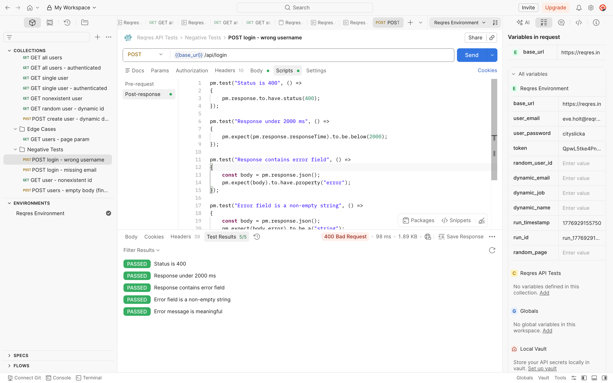

# API Testing — Reqres.in

A REST API test suite built with Python `requests` and `pytest`, with a matching Postman collection covering the same endpoints. Tests run automatically on every push via GitHub Actions CI.

[](https://github.com/InderParmar/api-testing-reqres/actions/workflows/api-tests.yml)
[](https://www.python.org/)
[](https://pytest.org/)

---


---

## What This Project Tests

### Authentication — `test_auth.py`
- Valid registration returns 200 with token and user ID
- Empty password returns 400 with descriptive error message
- Unknown email returns 400 with descriptive error message
- Missing required fields return 400
- Empty body returns 400
- Response Content-Type is application/json

### Users Endpoint — `test_users.py`
- Pagination metadata present and internally consistent
- Page number in response matches requested page
- Per-page count matches actual items returned
- Schema validation across all users on both pages
- Type checking — id is integer, email and avatar are strings
- Email format contains @ symbol, avatar starts with https://
- Single user retrieval — correct ID, schema, support field present
- Parametrized valid IDs `[1, 2, 3, 6, 10, 12]` all return 200
- Parametrized nonexistent IDs `[999, 1000, 99999]` all return 404
- No duplicate records across pagination pages
- Authenticated requests using session token
- Response time under 2 seconds on all endpoints

### Negative Cases — `test_negative.py`
- Parametrized invalid registration inputs across 6 bad input scenarios
- Error messages present, non-empty, and reference the missing field by name
- Nonexistent user IDs return 404 with empty body
- 404 responses do not expose stack traces or server internals
- Boundary values — page 0, page -1, page 99999 behaviour documented
- No pagination overlap between page 1 and page 2
- Error responses return JSON Content-Type
- Error response time under 2 seconds

---

## Tech Stack

| Tool | Purpose |
|------|---------|
| Python 3.11 | Language |
| `requests` | HTTP client |
| `pytest` | Test framework |
| `pytest-html` | HTML report generation |
| GitHub Actions | CI pipeline |
| Postman | Manual collection and request chaining |

---

## Project Structure

    api-testing-reqres/
    ├── .github/
    │   └── workflows/
    │       └── api-tests.yml       # CI pipeline definition
    ├── config/
    │   └── api_config.py           # Base URL, credentials, thresholds
    ├── utils/
    │   └── api_helper.py           # APIHelper wrapping requests.Session()
    ├── tests/
    │   ├── conftest.py             # Session-scoped fixtures: api, auth_token
    │   ├── test_auth.py            # 13 authentication tests
    │   ├── test_users.py           # 35 users endpoint tests
    │   └── test_negative.py        # 27 negative and edge case tests
    ├── postman/
    │   ├── Reqres_API_Tests.postman_collection.json
    │   └── Reqres_Environment.postman_environment.json
    ├── screenshots/
    ├── .gitignore
    ├── requirements.txt
    └── README.md

---

## How to Run Locally

```bash
git clone https://github.com/InderParmar/api-testing-reqres.git
cd api-testing-reqres

pip install -r requirements.txt
```

Create a `.env` file in the project root:

REQRES_API_KEY=your_key_here

The `.env` file is loaded automatically via `python-dotenv` — no manual export needed.
It is listed in `.gitignore` and never committed.

```bash
# Run all tests
pytest tests/ -v

# Run with HTML report
pytest tests/ --html=report.html --self-contained-html -v

# Run a specific file
pytest tests/test_auth.py -v

# Run with fixture setup visibility
pytest tests/ -v --setup-show
```

> **CI note:** In GitHub Actions the key is injected via repository secrets — no `.env` file needed in CI.---

## Key Design Decisions

**`requests.Session()`** — all requests share one persistent session, maintaining headers across calls and reusing the TCP connection. This mirrors real client behaviour more accurately than individual `requests.get()` calls.

**Session-scoped fixtures** — both `api` and `auth_token` use `scope="session"`. The APIHelper is instantiated once. Authentication runs once per test session. The token is shared across every test that needs it — no repeated network calls.

**Parametrized negative tests** — invalid input scenarios are defined as a data list, not separate functions. The test name in output includes the parameter value so failures are immediately identifiable. Adding a new negative scenario is one line.

**Config-driven constants** — no hardcoded values in test files. Base URL, credentials, response time threshold, and known bad inputs all live in `config/api_config.py`.

**Secrets via environment variables** — the API key is never in the codebase. Loaded from `REQRES_API_KEY` at runtime locally, and from GitHub repository secrets in CI.

---

## CI Pipeline

Every push to `main` triggers the workflow which:

1. Spins up a clean Ubuntu runner
2. Installs Python 3.11
3. Installs all dependencies from `requirements.txt`
4. Injects `REQRES_API_KEY` from GitHub repository secrets
5. Runs the full test suite with verbose output
6. Uploads an HTML report as a downloadable artifact — even on failure

---

## Postman Collection


The `postman/` directory contains an exported collection covering the same endpoints:

- Environment variables for base URL and credentials — no hardcoded values
- Request chaining — registration saves the token, all subsequent requests use it automatically

### Request Chaining — Token Before and After Login



- JavaScript assertions on every request — status code, response time, schema, field types
- Negative test folder with findings documented inline as test name prefixes
- Pre-request scripts generating dynamic data using `Date.now()` and `Math.random()`

To use: import `Reqres_API_Tests.postman_collection.json` into Postman, select `Reqres Environment`, run via Collection Runner.

### Collection Structure



---

## Test Results

### Python pytest — All Tests Passing Demo



### Negative Tests — 400 Status With All Assertions Green



---

## Known API Behaviour

Reqres.in changed behaviour during development. Each change was caught immediately by failing tests:

| Endpoint | Expected | Actual | Resolution |
|----------|----------|--------|------------|
| `POST /login` | Validates credentials, returns token | Acts as create endpoint | Switched to `POST /register` |
| Wrong password | Returns 400 | Returns 200 — registers anyway | Only empty password reliably returns 400 |
| Unknown routes | Returns 404 | Returns 200 with fallback data | Tests updated, behaviour documented |
| Rate limit | No limit | 250 requests/day, returns 429 | API key required, managed via env var |

This is documented intentionally. Third-party APIs change. Tests that detect those changes immediately are working correctly.

---

## Resume Bullet

> Built a REST API test suite using Python requests and pytest — covering authentication flows, schema validation, parametrized negative cases, and response time assertions — with GitHub Actions CI generating downloadable HTML reports on every push
